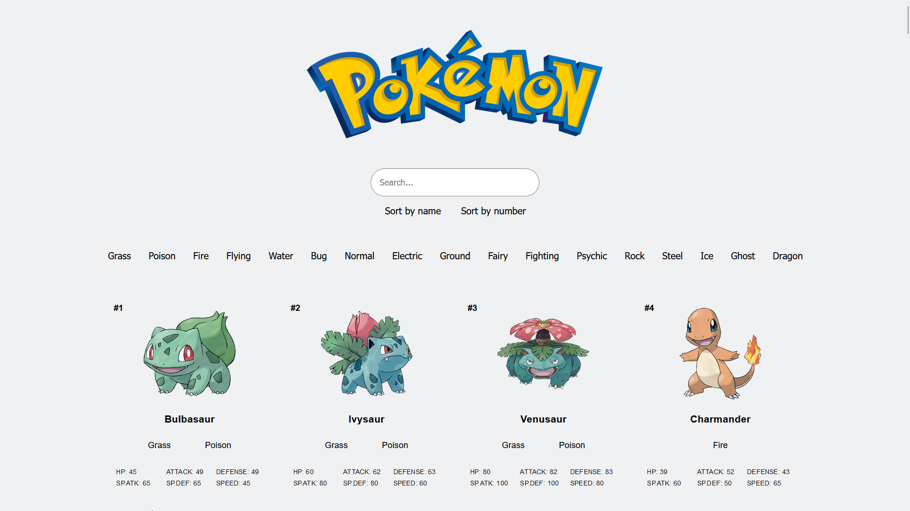

# apitask
We were assigned a task to create a webpage using one or more API. And this is the repository for my API webpage.

# PokeAPI

I chose to use the public and free PokeAPI for my task. It gave me a wonderful opportunity to work with generating a gallery of cards that are dynamically created using extracted information from the API.
This task also gave me ample opportunity to create a functional search bar and a toggle on and off filter system. Which was a very fun, challenging and exciting experience for me.

I did not take the time to make this a responsive website as much of my time went into the javascript parts of it. 

# Click [here](https://skodehode.github.io/apitask/) to visit the page!